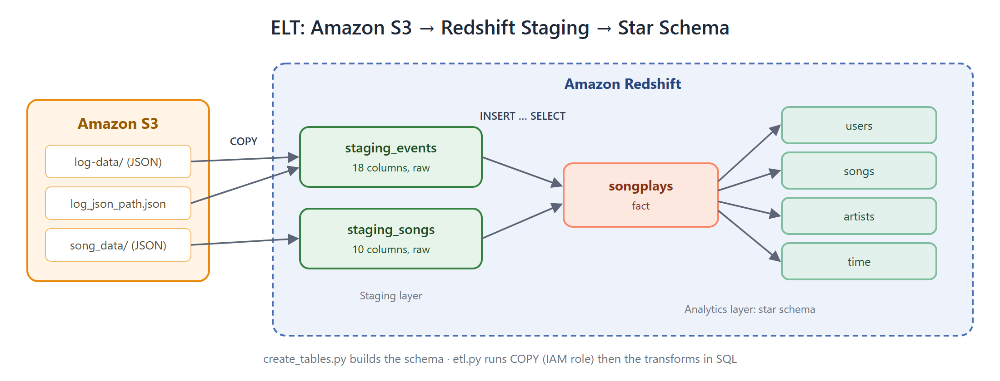
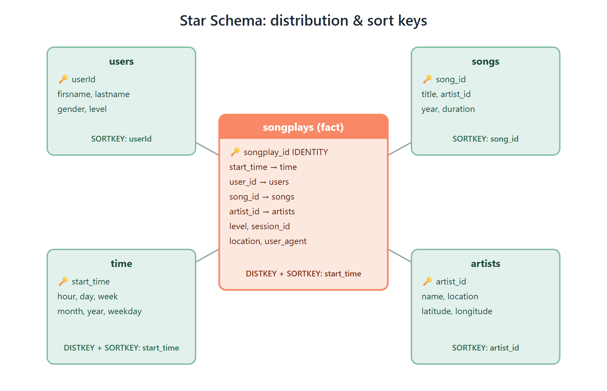

# Cloud Data Warehouse on Amazon Redshift


> **An ELT pipeline that bulk-loads raw JSON from S3 into Redshift, then reshapes it in SQL into a star schema with distribution and sort keys chosen for fast analytics.**



---

## 🔍 What This Project Does

**From JSON files to a warehouse you can query.**

A music streaming app ("Sparkify") keeps its user activity logs and song metadata as thousands of small JSON files in S3. Analysts can't easily answer questions like *"which songs are played most, by whom, and when?"* from those files. This project builds a **cloud data warehouse** on Amazon Redshift to answer them:

1. **Extract and load (E + L):** Redshift `COPY` bulk-loads the raw JSON from S3 into two staging tables in parallel across slices, authenticated through an **IAM role** with no keys in the SQL.
2. **Transform (T):** `INSERT … SELECT` statements run *inside* Redshift and turn the staging data into a **star schema**: 1 fact table and 4 dimension tables.
3. **Provision (IaC):** a Python + boto3 utility creates (and later deletes) the IAM role, the security group and the Redshift cluster from a config file.

---

## 🔄 ELT Pipeline

| | Step | Script | What happens |
|---|---|---|---|
| 🧹 | Reset schema | `create_tables.py` | Drops and recreates all 7 tables, so reruns are idempotent |
| 📥 | Stage events | `etl.py` | `COPY` of `log-data/` with a **JSONPaths** file mapping 18 fields to columns |
| 📥 | Stage songs | `etl.py` | `COPY` of `song_data/` with `FORMAT AS JSON 'auto'` |
| ⭐ | Build fact | `etl.py` | Events (`page='NextSong'`) ⨝ songs on title + artist. Epoch ms are converted to `TIMESTAMP` |
| 🗂️ | Build dimensions | `etl.py` | Distinct users, songs and artists; time split into hour, day, week, month, year and weekday |
| 📜 | All SQL | `sql_queries.py` | DDL, COPY and transforms in one file |

---

## ⭐ Data Model and Redshift Tuning



| Table | Type | Distribution / Sort | Why |
|---|---|---|---|
| `songplays` | **Fact** | `DISTKEY(start_time)` · `SORTKEY(start_time)` | Co-located with `time` so joins don't shuffle data; fast date-range scans |
| `time` | Dimension | `DISTKEY(start_time)` · `SORTKEY(start_time)` | Same distribution key as the fact table, so joins happen on the same node |
| `users` | Dimension | `SORTKEY(userId)` | Fast lookups by user |
| `songs` | Dimension | `SORTKEY(song_id)` | Fast lookups by song |
| `artists` | Dimension | `SORTKEY(artist_id)` | Fast lookups by artist |
| `staging_events` | Staging | n/a | Raw landing table: 18 columns |
| `staging_songs` | Staging | n/a | Raw landing table: 10 columns |

**Compression:** low-cardinality columns (`gender`, `level`, `year`, `weekday`) use `BYTEDICT` encoding to cut storage and I/O.

---

## 🏗️ Infrastructure as Code

`infra/Redshift_Cluster_IaC.py` sets up the whole environment from one config file:

| | Step | AWS API |
|---|---|---|
| 🔐 | Create an IAM role Redshift can assume and attach `AmazonS3ReadOnlyAccess` | `iam.create_role`, `attach_role_policy` |
| 🛡️ | Create a VPC security group with an inbound rule on port 5439 | `ec2.create_security_group`, `authorize_security_group_ingress` |
| 🚀 | Launch the Redshift cluster with that role and security group | `redshift.create_cluster` |
| 🧨 | Tear everything down (`--delete TRUE`) and wait until the cluster is deletable | `delete_cluster`, `delete_security_group`, `delete_role` |

Logging is configured through `logging.ini`, and the script has a CLI built with `argparse`.

---

## 🛠️ What I Built and Changed

- **Designed the star schema**, choosing distribution keys, sort keys and column encodings for Redshift's MPP architecture.
- **Wrote the ELT SQL**: two `COPY` statements (one with JSONPaths) and five `INSERT … SELECT` transforms, including epoch-to-timestamp conversion.
- **Wrote the boto3 IaC utility** to create and delete the IAM role, security group and cluster, with logging and a CLI.
- **Moved all configuration into templates** (`dwh.cfg.example` and `infra/cluster.config.example`). The real config files are gitignored, so no credentials are committed.
- **Included a ready-to-upload sample dataset** (`data/`) with the JSONPaths file. macOS `.DS_Store` files were removed because they break `COPY`.
- **Documented two ways to deploy**: Redshift Serverless for the quickest setup, or a provisioned cluster through the IaC script.

---

## ⚡ Quick Start

```bash
# 1. Clone
git clone https://github.com/Khushipatel27/cloud-data-warehouse-redshift.git
cd cloud-data-warehouse-redshift

# 2. Install dependencies
pip install -r requirements.txt

# 3. Upload sample data to S3 (same region as Redshift)
aws s3 sync data/ s3://<your-bucket>/

# 4. Create Redshift: either Serverless in the console, or with the IaC script
cd infra && cp cluster.config.example cluster.config   # fill in
python Redshift_Cluster_IaC.py --create TRUE --delete FALSE
cd ..

# 5. Configure the connection
cp dwh.cfg.example dwh.cfg      # host, user, password, IAM role ARN, S3 paths

# 6. Run
python create_tables.py
python etl.py
```

**Verify** in the Redshift query editor:
```sql
-- Top 5 most-played songs
SELECT s.title, COUNT(*) AS plays
FROM songplays sp JOIN songs s ON sp.song_id = s.song_id
GROUP BY s.title ORDER BY plays DESC LIMIT 5;
```

**Clean up:** run `python infra/Redshift_Cluster_IaC.py --create FALSE --delete TRUE`, or delete the Serverless workgroup.

> 💡 If you use Redshift Serverless, attach the IAM role to the namespace, turn on **Publicly accessible**, and allow inbound TCP 5439 from your IP.

---

## 📚 Dataset

| | Source | Contents |
|---|---|---|
| 🎵 | `data/song_data/` | 71 JSON files from the [Million Song Dataset](http://millionsongdataset.com/): song, artist, duration, year |
| 📝 | `data/log-data/` | 30 daily JSON logs from an [event simulator](https://github.com/Interana/eventsim): **8,026 events**, **6,801 song plays**, 98 users |
| 🗺️ | `data/log_json_path.json` | JSONPaths file for `COPY` into `staging_events` |

---

## 📁 Project Structure

```
cloud-data-warehouse-redshift/
├── create_tables.py              ← drop + create all 7 tables
├── etl.py                        ← COPY to staging → INSERT…SELECT to star schema
├── sql_queries.py                ← all DDL, COPY and transform SQL
├── dwh.cfg.example               ← connection/IAM/S3 config template
├── requirements.txt              ← psycopg2-binary, boto3
│
├── infra/
│   ├── Redshift_Cluster_IaC.py   ← boto3: IAM role + security group + cluster
│   ├── Redshift_IaC_README.md    ← IaC usage guide
│   ├── Redshift_test.py          ← connection smoke test
│   ├── cluster.config.example    ← IaC config template
│   └── logging.ini               ← logger config
│
├── data/                         ← sample dataset to upload to S3
│   ├── log-data/
│   ├── song_data/
│   └── log_json_path.json
│
└── docs/images/                  ← architecture & schema diagrams
```

---

## ⚠️ Notes

- `dwh.cfg` and `cluster.config` hold credentials. They're **gitignored**, so never commit them.
- Keep the `[CLUSTER]` keys in `dwh.cfg` in the template's order, because the scripts read them by position.
- Redshift bills while it's running, so always tear it down after testing.

---

<p align="center">Built with ❤️ by <b>Khushi Patel</b></p>
