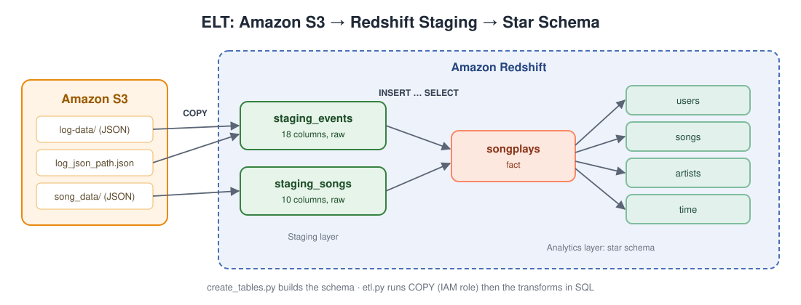
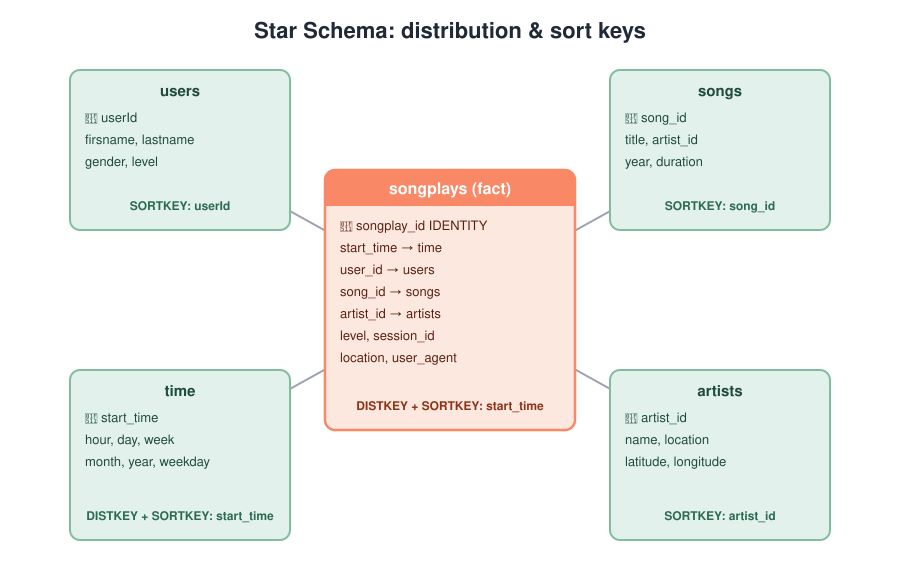

# Cloud Data Warehouse on Amazon Redshift

An ELT pipeline that loads raw JSON song and user-activity data from **Amazon S3** into **Amazon Redshift** staging tables, then transforms it with SQL into a **star schema** tuned for analytics with distribution and sort keys. It also includes a **Python IaC utility** (boto3) that provisions the Redshift cluster, IAM role and security group.



## Tech Stack

`Amazon Redshift` · `Amazon S3` · `AWS IAM` · `Python` · `SQL` · `psycopg2` · `boto3`

## Problem

A music streaming startup ("Sparkify") stores its app activity logs and song metadata as JSON files in S3. The analytics team needs to query this data easily, for example to find which songs users listen to, when, and on which plan. This project moves the data into a cloud data warehouse that's designed for those queries.

## How it works

1. **`create_tables.py`** drops and recreates all seven tables (idempotent rebuild).
2. **`etl.py`** runs:
   - **Extract/Load:** Redshift `COPY` bulk-loads S3 JSON into `staging_events` (using a JSONPaths file) and `staging_songs` (`auto`), authenticated through an IAM role.
   - **Transform:** `INSERT … SELECT` statements build the fact and dimension tables inside Redshift. Epoch ms timestamps are converted to `TIMESTAMP`, and `time` attributes are derived from them.
3. **`sql_queries.py`** holds all DDL, COPY and transform SQL in one place.

## Data Model



| Table | Type | Distribution / Sort |
|---|---|---|
| `songplays` | Fact: one row per song play | `DISTKEY(start_time)`, `SORTKEY(start_time)` |
| `users` | Dimension | `SORTKEY(userId)` |
| `songs` | Dimension | `SORTKEY(song_id)` |
| `artists` | Dimension | `SORTKEY(artist_id)` |
| `time` | Dimension | `DISTKEY(start_time)`, `SORTKEY(start_time)` |

Because `songplays` and `time` share `start_time` as their distribution key, the rows they join on live on the same node, so time-based joins don't shuffle data between nodes. Low-cardinality columns like `gender`, `level` and `year` use `BYTEDICT` encoding to save storage.

## Project Structure

```
.
├── create_tables.py          # Drop + create schema
├── etl.py                    # COPY to staging, then transform into star schema
├── sql_queries.py            # All SQL (DDL, COPY, INSERT…SELECT)
├── dwh.cfg.example           # Config template (copy to dwh.cfg)
├── requirements.txt
├── data/                     # Sample dataset to upload to S3
│   ├── log-data/
│   ├── song_data/
│   └── log_json_path.json
├── infra/                    # Redshift Infrastructure-as-Code (boto3)
│   ├── Redshift_Cluster_IaC.py
│   ├── Redshift_IaC_README.md
│   ├── cluster.config.example
│   └── logging.ini
└── docs/images/
```

---

## Running It

### Prerequisites
- Python 3.8 or later
- An AWS account

### 1. Install dependencies
```bash
pip install -r requirements.txt
```

### 2. Upload the sample data to S3
Create a bucket in the same region you'll use for Redshift, then run:
```bash
aws s3 sync data/ s3://<your-bucket>/
```

### 3. Create Redshift and an IAM role
**Option A: Redshift Serverless (easiest)**
1. In IAM, create a role for **Redshift**, attach `AmazonS3ReadOnlyAccess` and copy its ARN.
2. Create a Redshift Serverless workgroup and associate the role with its namespace.
3. Turn on **Publicly accessible**, and in the security group allow inbound TCP `5439` from your IP.

**Option B: Provisioned cluster with the IaC script**
```bash
cd infra
cp cluster.config.example cluster.config   # fill in your values
python Redshift_Cluster_IaC.py --create TRUE --delete FALSE
```
See [infra/Redshift_IaC_README.md](infra/Redshift_IaC_README.md). The script uses `us-east-1`.

### 4. Configure
```bash
cp dwh.cfg.example dwh.cfg
```
Fill in the host, user, password, IAM role ARN and your S3 paths.

### 5. Run
```bash
python create_tables.py
python etl.py
```

### 6. Verify
Run these in the Redshift query editor:
```sql
SELECT COUNT(*) FROM staging_events;
SELECT COUNT(*) FROM songplays;

-- Top 5 most-played songs
SELECT s.title, COUNT(*) AS plays
FROM songplays sp JOIN songs s ON sp.song_id = s.song_id
GROUP BY s.title ORDER BY plays DESC LIMIT 5;
```

### 7. Clean up
Delete the Serverless workgroup, or run `python Redshift_Cluster_IaC.py --create FALSE --delete TRUE`, so you aren't charged.
